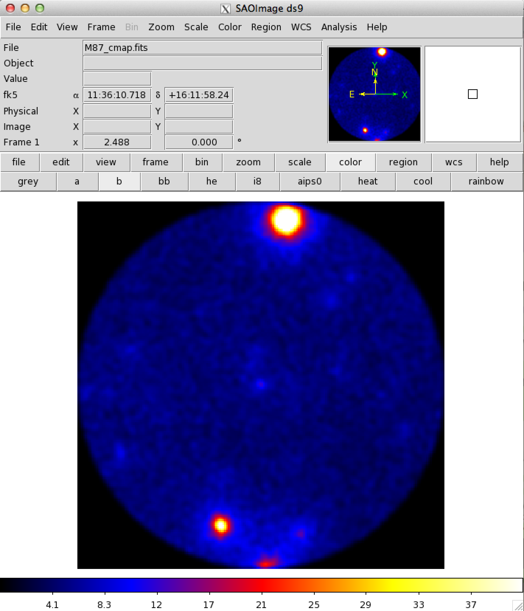
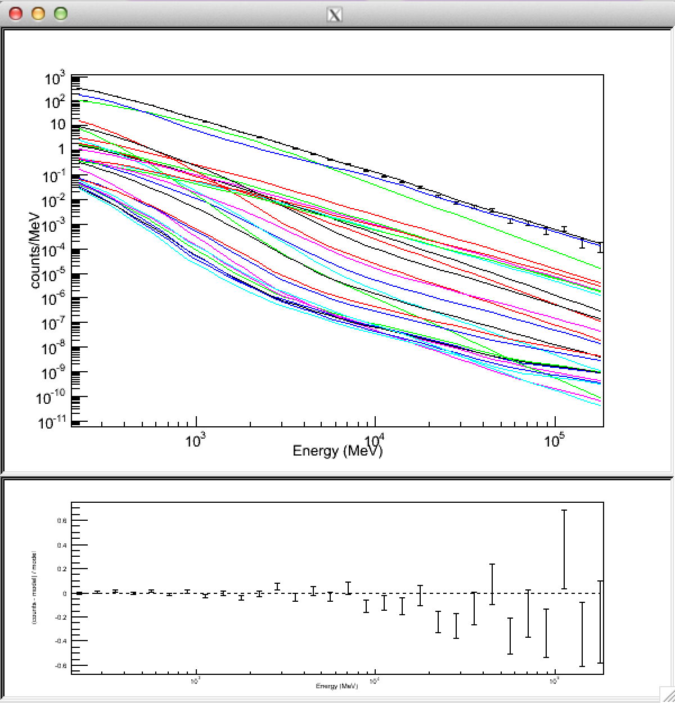
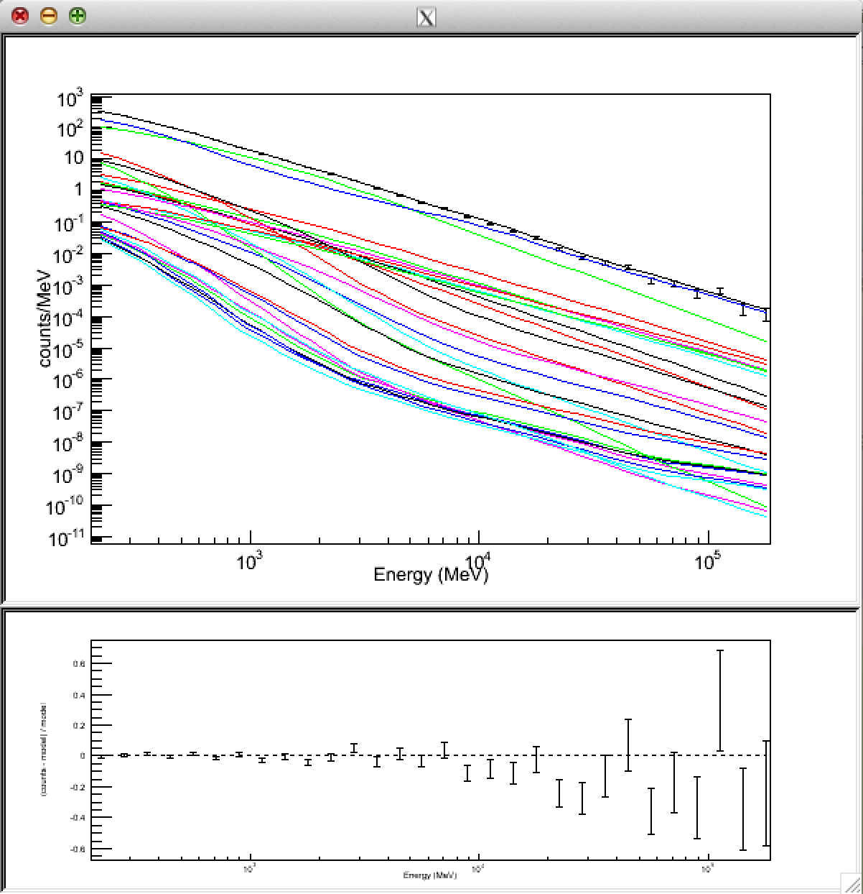
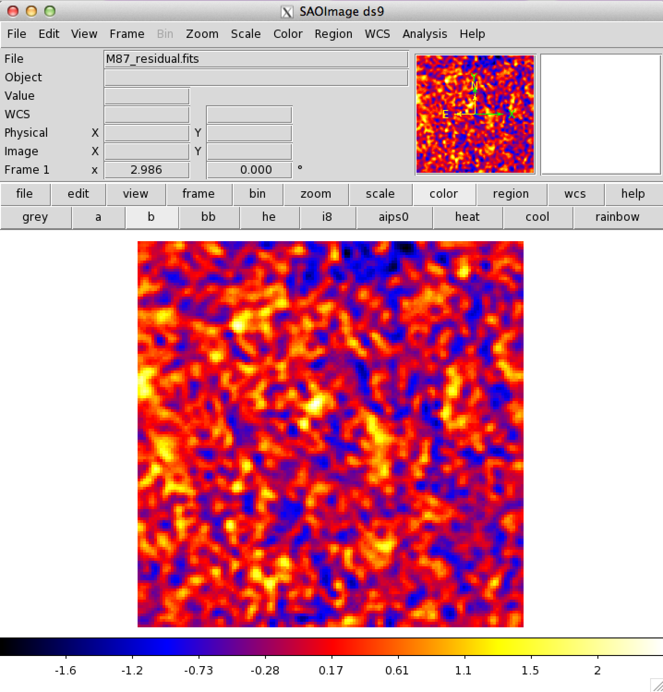
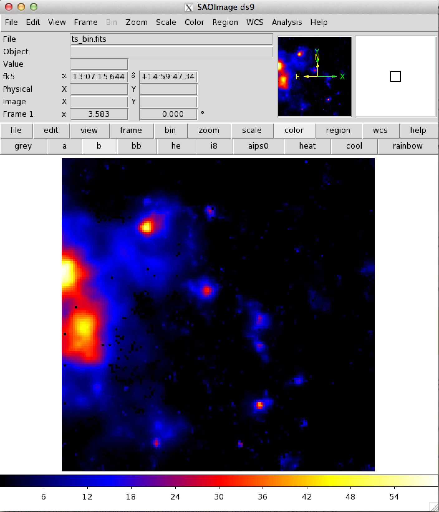

# Binned Likelihood Method

Fermi-LAT[官方教程](http://fermi.gsfc.nasa.gov/ssc/data/analysis/scitools/binned_likelihood_tutorial.html)

## 目录结构

M87

>data_binned  
>>events  
>>M87.fits

>binned  
>>where to put all the [scripts](binned/)  


## 数据选取

* SOURCE data (evclass=2)

* 能量范围：200MeV - 200GeV

* 时间范围：第9周至第313周 (MET 239557417 - MET 423454364)

* ROI中心：(RA, DEC) = (187.706, 12.3911) degrees

* ROI半径：10 degrees


## 变量定义

最好考虑多脚本之间的重用特性。

[var_common.gts](binned/var_common.gts):
```bash
#!/bin/bash

par_srcname=M87
par_irfs=P7REP_SOURCE_V15

file_filtered=../data_binned/${par_srcname}.fits
file_filtered_gti=${par_srcname}_gti.fits
file_spacecraft=~/data_Fermi/spacecraft.fits
file_cmap=${par_srcname}_cmap.fits
file_ccube=${par_srcname}_ccube.fits
file_ltcube=${par_srcname}_ltcube.fits
file_expcube=${par_srcname}_expcube.fits
file_srcmap=${par_srcname}_srcmap.fits
file_model_initial=model_input_binned.xml
file_model_1st=model_1st_binned.xml
file_model_final=model_output_binned.xml
file_modelpred=${par_srcname}_modelpred.fits
file_residual=${par_srcname}_residual.fits
file_model_tsmap_resi=model_tsmap_resi.xml
file_tsmap_resi=${par_srcname}_tsmap_resi.fits

position=`gtvcut $file_filtered EVENTS | sed -n '/CIRCLE/ s/.*(\(.*\))/\1/p'`
par_ra=`echo $position | cut -d , -f 1` 
par_dec=`echo $position | cut -d , -f 2`
par_emin=200
par_emax=200000

par_nxpix=140
par_nypix=140
par_binsz=0.1
par_enumbins=30
```

## 与飞船有关的计算

gtmktime, gtltcube, gtexpcube2.

[sc_filter.gts](binned/sc_filter.gts):
```bash
#!/bin/bash

. var_common.gts &&

gtmktime scfile=$file_spacecraft filter="(DATA_QUAL==1)&&(LAT_CONFIG==1)&&ABS(ROCK_ANGLE)<52" roicut=yes evfile=$file_filtered outfile=$file_filtered_gti &&

#gtltcube evfile=$file_filtered_gti scfile=$file_spacecraft outfile=$file_ltcube dcostheta=0.025 binsz=1 &&

python gtltcube_mp.py 20 $file_spacecraft $file_filtered_gti $file_ltcube --zmax 100 &&

gtexpcube2 infile=$file_ltcube cmap=none outfile=$file_expcube irfs=$par_irfs nxpix=400 nypix=400 binsz=0.2 coordsys=CEL xref=$par_ra yref=$par_dec axisrot=0 proj=AIT ebinalg=LOG emin=$par_emin emax=$par_emax enumbins=$par_enumbins ebinfile=none &&

echo
```

## 一个简单直观的view

gtbin.

[cmap.gts](binned/cmap.gts):
```bash
#!/bin/bash

. var_common.gts &&

gtbin evfile=$file_filtered_gti scfile=$file_spacecraft outfile=$file_cmap algorithm=CMAP nxpix=200 nypix=200 binsz=0.1 coordsys=CEL xref=$par_ra yref=$par_dec axisrot=0 proj=AIT &&

echo
```

counts map:



## 生成模型xml文件

使用[make2FGLxml](http://fermi.gsfc.nasa.gov/ssc/data/analysis/user/)包来生成与当前数据相关的2FGL源的model文件。

[model.py](binned/model.py):
```python
# For P7REP_SOURCE_V15 data, ST version v9r33p0
from make2FGLxml import *
import os
import commands as cmd

srcfile = cmd.getoutput(". ./var_common.gts && echo $file_filtered_gti")
catalog_dir = os.environ.get('HOME') + '/data_Fermi/catalog'

mymodel = srcList(catalog_dir + '/gll_psc_v08.fit',
                  srcfile, 'model.xml')
pathtodiffusefiles = os.environ.get('FERMI_DIR') + '/refdata/fermi/galdiffuse'
mymodel.makeModel(pathtodiffusefiles + '/gll_iem_v05_rev1.fit',
                  'gll_iem_v05_rev1',
                  pathtodiffusefiles + '/iso_source_v05_rev1.txt',
                  'iso_source_v05',
                  extDir=catalog_dir + '/Templates')
```

生成该文件后，还要手动进行修改，目的是：  
1. **增加目标源**（如不在2FGL中），或修改目标源名称以便识别（如在2FGL中），后者不是必须；  
2. **固定一部分参数**以降低不必要的计算量。

## Binned likelihood

gtbin, gtsrcmaps, gtlike.

[like_binned.gts](binned/like_binned.gts):
```bash
#!/bin/bash

. var_common.gts &&

gtbin evfile=$file_filtered_gti scfile=$file_spacecraft outfile=$file_ccube algorithm=CCUBE ebinalg=LOG emin=$par_emin emax=$par_emax enumbins=$par_enumbins nxpix=$par_nxpix nypix=$par_nypix binsz=$par_binsz coordsys=CEL xref=$par_ra yref=$par_dec axisrot=0 proj=AIT &&

gtsrcmaps scfile=$file_spacecraft expcube=$file_ltcube cmap=$file_ccube srcmdl=$file_model_initial bexpmap=$file_expcube outfile=$file_srcmap irfs=$par_irfs ptsrc=no &&

gtlike irfs=$par_irfs expcube=$file_ltcube srcmdl=$file_model_initial statistic=BINNED optimizer=DRMNFB evfile=$file_filtered_gti scfile=$file_spacecraft cmap=$file_srcmap bexpmap=$file_expcube sfile=$file_model_1st results=result_1st.dat plot=yes &&

gtlike irfs=$par_irfs expcube=$file_ltcube srcmdl=$file_model_1st statistic=BINNED optimizer=NEWMINUIT evfile=$file_filtered_gti scfile=$file_spacecraft cmap=$file_srcmap bexpmap=$file_expcube sfile=$file_model_final results=result_final.dat plot=yes &&

echo
```

两次gtlike的plot:



## 计算residual map作为对结果的检查

gtbin, gtmodel, farith.

[residual.gts](binned/residual.gts):
```bash
#!/bin/bash

. var_common.gts &&

gtbin evfile=$file_filtered_gti scfile=$file_spacecraft outfile=$file_cmap algorithm=CMAP nxpix=$par_nxpix nypix=$par_nypix binsz=$par_binsz coordsys=CEL xref=$par_ra yref=$par_dec axisrot=0 proj=AIT &&

gtmodel srcmaps=$file_srcmap srcmdl=$file_model_final outfile=$file_modelpred irfs=$par_irfs expcube=$file_ltcube bexpmap=$file_expcube &&

farith $file_cmap $file_modelpred $file_residual SUB clobber=yes &&

echo
```

残差图：



## 计算TS map

gttsmap.

[TS map](binned/tsmap.gts):
```bash
#!/bin/bash

. var_common.gts &&

gttsmap statistic=BINNED scfile=$file_spacecraft evfile=$file_filtered_gti cmap=$file_ccube bexpmap=$file_expcube expcube=$file_ltcube srcmdl=$file_model_tsmap_resi irfs=$par_irfs optimizer=NEWMINUIT outfile=$file_tsmap_resi nxpix=$par_nxpix nypix=$par_nypix binsz=$par_binsz coordsys=CEL xref=$par_ra yref=$par_dec proj=AIT &&

echo
```

TS map:

