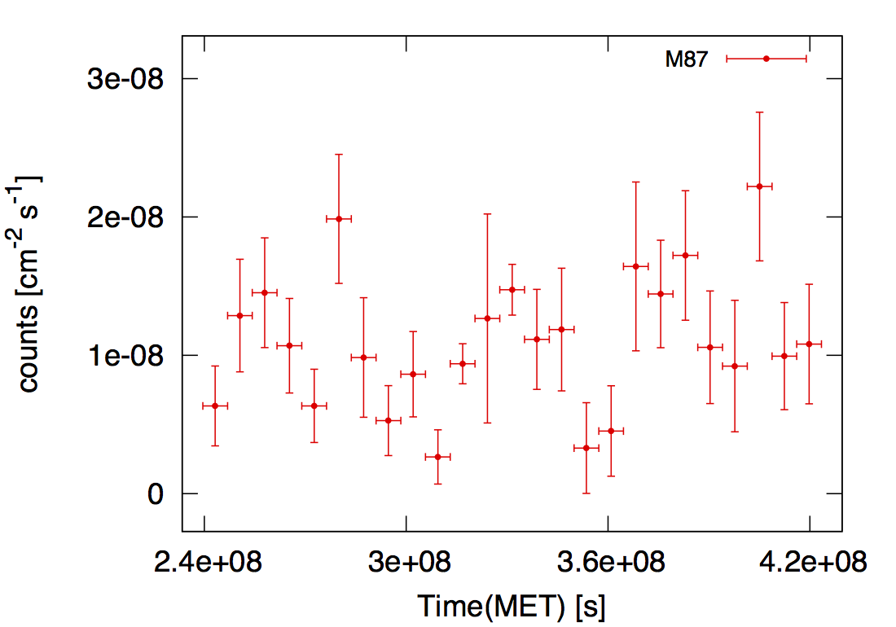
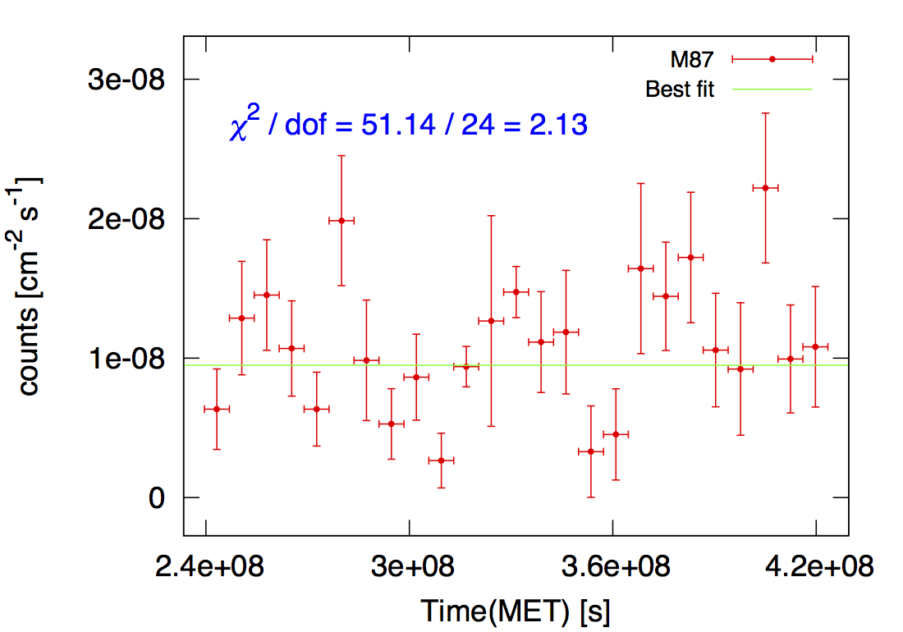

# Light Curve (LC)

## 目录结构

M87

>data_binned  
>>M87.fits

>lc  
>>[lc.gts](lc/lc.gts)  
>>[ul.py](lc/ul.py)  
>>[tranges.gts](lc/tranges.gts)  
>>[tranges.dat](lc/tranges.dat)  
>>[plt_gen.py](lc/plt_gen.py)  
>>[lc.plt.in](lc/lc.plt.in)  
>>[model_input_lc.xml](lc/model_input_lc.xml)

## 产生时间分bin文件

运行[tranges.gts](lc/tranges.gts)，输入分bin的个数（本例中为25），即可得到分bin的文件：  
[tranges.dat](lc/tranges.dat):
```
239557417
246913295
254269173
261625051
268980929
276336806
283692684
291048562
298404440
305760318
313116196
320472074
327827952
335183829
342539707
349895585
357251463
364607341
371963219
379319097
386674975
394030852
401386730
408742608
416098486
423454364
```
可以用#来注释行。

## 模型文件的选择

如果没有特殊情况或特别要求的话，建议选用全能段gtlike(binned或unbinned)得到的输出model文件来作为SED计算时gtlike的输入model，
不过最好把目标源(M87)的Prefactor的拟合范围的边界放宽一些，以保证在计算上限时不会走到边界。

## 跑LC

直接上code.  
[lc.gts](lc/lc.gts):
```bash
#!/bin/bash

#ln -sf ../unbinned/var_common.gts var_common.gts
. var_common.gts

file_filtered_tbin=${par_srcname}.fits
dir_results=results
rm -rf $dir_results && mkdir $dir_results
file_model_initial=model_input_lc.xml

echo '#Tmin Tmax Flux FluxErr TS' > flux_tmp

cat tranges.dat | sed '/^#/d' | sed '1!H;x;1d' | sed 'N;s/\n/ /' |
while read par_tmin par_tmax
do
  [[ "x$flag" = "x0" ]] && break
  flag=1

  file_model_1st=$dir_results/model_1st_${par_tmin}_$par_tmax.xml
  file_model_final=$dir_results/model_final_${par_tmin}_$par_tmax.xml
  file_model_ul=$dir_results/model_ul_${par_tmin}_$par_tmax.xml
  file_result_1st=$dir_results/result_1st_${par_tmin}_$par_tmax.dat
  file_result_final=$dir_results/result_final_${par_tmin}_$par_tmax.dat

  gtselect infile=$file_filtered outfile=$file_filtered_tbin ra=INDEF dec=INDEF rad=INDEF tmin=$par_tmin tmax=$par_tmax emin=$par_emin emax=$par_emax zmax=100 &&
  gtmktime scfile=$file_spacecraft filter="(DATA_QUAL==1)&&(LAT_CONFIG==1)&&ABS(ROCK_ANGLE)<52" roicut=yes evfile=$file_filtered_tbin outfile=$file_filtered_gti &&
  gtltcube evfile=$file_filtered_gti scfile=$file_spacecraft outfile=$file_ltcube dcostheta=0.025 binsz=1 &&
  #python gtltcube_mp.py 5 $file_spacecraft $file_filtered_gti $file_ltcube --zmax 100 &&
  gtexpmap evfile=$file_filtered_gti scfile=$file_spacecraft expcube=$file_ltcube outfile=$file_expmap irfs=$par_irfs srcrad=$par_srcrad nlong=$par_nlong nlat=$par_nlat nenergies=$par_nenergies &&
  #python gtexpmap_mp.py $par_nlong $par_nlat 4 4 $file_spacecraft $file_filtered_gti $file_ltcube $par_irfs $par_srcrad $par_nenergies $file_expmap &&
  #gtdiffrsp evfile=$file_filtered_gti scfile=$file_spacecraft srcmdl=$file_model_intitial irfs=$par_irfs &&
  gtlike irfs=$par_irfs expcube=$file_ltcube srcmdl=$file_model_initial statistic=UNBINNED optimizer=DRMNFB evfile=$file_filtered_gti scfile=$file_spacecraft expmap=$file_expmap sfile=$file_model_1st results=$file_result_1st &&
  gtlike irfs=$par_irfs expcube=$file_ltcube srcmdl=$file_model_1st statistic=UNBINNED optimizer=NEWMINUIT evfile=$file_filtered_gti scfile=$file_spacecraft expmap=$file_expmap sfile=$file_model_final results=$file_result_final &&

  flag=1 || flag=0

  [[ "x$flag" = "x0" ]] && continue

  flux=`egrep "$par_srcname|Flux" $file_result_final | grep $par_srcname -A 1 | grep Flux | cut -d "'" -f 4 | cut -d ' ' -f 1`
  fluxErr=`egrep "$par_srcname|Flux" $file_result_final | grep $par_srcname -A 1 | grep Flux | cut -d "'" -f 4 | cut -d ' ' -f 3`
  Npred=`egrep "$par_srcname|Npred" $file_result_final | grep $par_srcname -A 1 | grep Npred | cut -d "'" -f 4`
  TS=`egrep "$par_srcname|TS" $file_result_final | grep $par_srcname -A 1 | grep TS | cut -d "'" -f 4`
  if [ `awk -v f=$flux -v fe=$fluxErr -v Np=$Npred 'BEGIN{if(f/fe > sqrt(Np)) print 0; else print 1}'` = 0 ]
  then
    fluxErr=`awk -v f=$flux -v Np=$Npred 'BEGIN{print f / sqrt(Np)}'`
  fi

  if [ `awk -v ts=$TS "BEGIN{if(ts > 4) print 1; else print 0}"` = 1 ]
  then
    echo "$par_tmin $par_tmax $flux $fluxErr $TS" >> flux_tmp
  else
    echo "#$par_tmin $par_tmax $flux $fluxErr $TS" >> flux_tmp &&
    # fix all parameters of the target source in the model file used by the Upper Limit calculation.
    awk 'BEGIN{tag=0} /^.*'$par_srcname'/{tag=1}{if(tag==1) sub(/free=\"1\"/, "free=\"0\""); print}/^.*<\/source>$/{tag=0}' $file_model_final > $file_model_ul &&
    python ul.py ul.dat $par_srcname $par_irfs $par_emin $par_emax $file_filtered_gti $file_spacecraft $file_expmap $file_ltcube $file_model_ul &&
    ul=`cat ul.dat | sed 's/^\[\([^ ]*\).*$/\1/'` &&
    echo "$par_tmin $par_tmax $ul 0 -1e9" >> flux_tmp &&
    rm -rf ul.dat &&
    flag=1 || flag=0
  fi
done

column -t flux_tmp > flux.dat
rm -rf flux_tmp

python plt_gen.py $par_srcname
gnuplot lc.plt
```
其中调用了两个python脚本：  
1. [ul.py](lc/ul.py)，这是用来计算上限的，TS小于设定值时会触发调用。注意和做SED时用的[ul.py](/sed/ul.py)不同，
SED用的是BinnedLikelihood，LC用的是UnbinnedLikelihood.  
1. [plt_gen.py](lc/plt_gen.py)，这个脚本是根据SED计算得到的[flux.dat](lc/flux.dat)，
完善Gnuplot绘图脚本草稿[lc.plt.in](lc/lc.plt.in)得到最终绘图脚本[lc.plt](lc/lc.plt).

另外需要注意的是，计算upper limit时所用的model文件中，目标源(M87)最多只能放开第一个Prefactor参数，
其实Prefactor放不放开没任何区别，我的脚本中就把目标源的参数全固定了。

*代码中的一些细节处理建议大家仔细看一下。*

得到的结果data如下：  
[flux.dat](lc/flux.dat)
```
#Tmin      Tmax       Flux         FluxErr      TS
239557417  246913295  6.33937e-09  2.88474e-09  19.5819
246913295  254269173  1.2872e-08   4.06966e-09  23.4898
254269173  261625051  1.45239e-08  3.96604e-09  51.1671
261625051  268980929  1.06913e-08  3.41809e-09  40.6503
268980929  276336806  6.34326e-09  2.6507e-09   28.3105
276336806  283692684  1.98627e-08  4.66186e-09  82.3065
283692684  291048562  9.8417e-09   4.32322e-09  12.5877
291048562  298404440  5.28196e-09  2.52574e-09  22.7763
298404440  305760318  8.6325e-09   3.08717e-09  28.2414
305760318  313116196  2.65336e-09  1.96111e-09  11.6673
313116196  320472074  9.38626e-09  1.44737e-09  16.3899
320472074  327827952  1.26653e-08  7.5555e-09   15.9079
327827952  335183829  1.47419e-08  1.83739e-09  28.5742
335183829  342539707  1.11518e-08  3.61923e-09  52.2912
342539707  349895585  1.18614e-08  4.43376e-09  25.0989
349895585  357251463  3.29597e-09  3.27446e-09  11.6717
357251463  364607341  4.52712e-09  3.26727e-09  5.80051
364607341  371963219  1.64269e-08  6.10504e-09  12.5137
371963219  379319097  1.44335e-08  3.88564e-09  43.1233
379319097  386674975  1.72208e-08  4.68118e-09  47.8887
386674975  394030852  1.05799e-08  4.07005e-09  39.3677
394030852  401386730  9.22073e-09  4.75447e-09  7.89552
401386730  408742608  2.22042e-08  5.37296e-09  57.6187
408742608  416098486  9.93912e-09  3.87183e-09  63.3272
416098486  423454364  1.08147e-08  4.32496e-09  22.5063
```

## 最终结果

给大家展示一下结果，这是从第9周到第313周的数据的结果：


## 是否有（明显的）光变？

### 方法一

假定无光变，则流量为一常数，用最小二乘法拟合出该常数，并计算对应的Q检验量。
最小二乘的Q检验量是服从自由度为N-1的卡方分布的，于是可以作为是否有明显光变的判据。  
[fit.py](lc/fit.py)
```python
import numpy as np

flux, fluxErr = np.loadtxt('flux.dat', usecols=(2, 3), unpack=True)

'''Avoiding the upper limit points'''
x = flux[np.where(abs(fluxErr) > 1e-30)]
xerr = fluxErr[np.where(abs(fluxErr) > 1e-30)]
w = 1.0 / xerr ** 2

dof = len(x) - 1

a = (w * x).sum() / w.sum()
aerr = np.sqrt(1.0 / w.sum())
chi2 = ((x - a) ** 2 * w).sum()

print 'y =', a
print 'chi2 / dof =', chi2, '/', dof, '=', chi2 / dof
```


基本可以认为，无明显光变。

### 方法二

参见
[Liao et al. 2014, ApJ, 783, 83](http://iopscience.iop.org/0004-637X/783/2/83/pdf/apj_783_2_83.pdf)
的4.3.2节第(3)-(6)式给出的方法。

### 两种方法的适应性

方法一对error很小的数据点非常敏感，方法二对error很大的数据点非常敏感。  
所以，在使用方法一时，要注意检查是否有error不合理地过小的数据点；
在使用方法二时，要注意检查是否有error不合理地过大的数据点。
