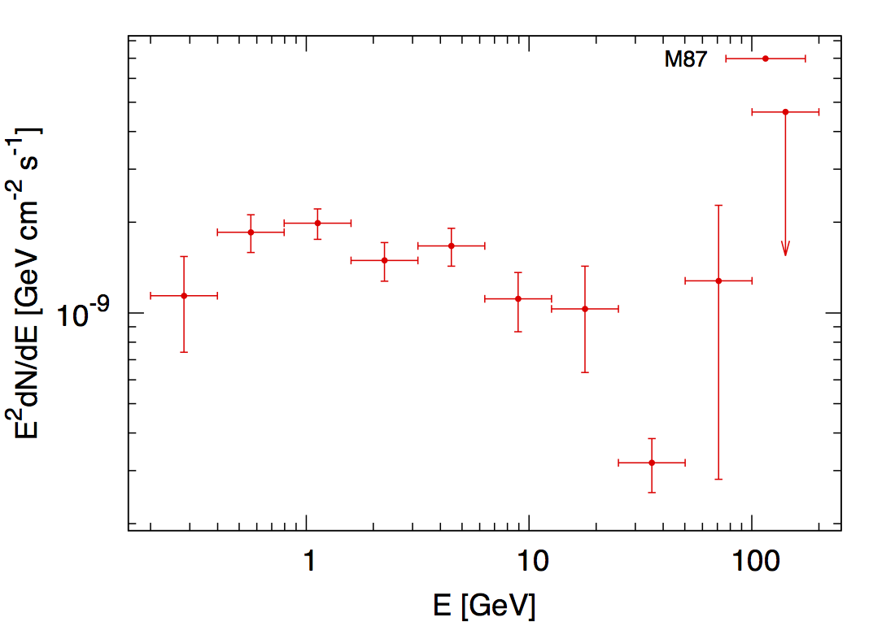
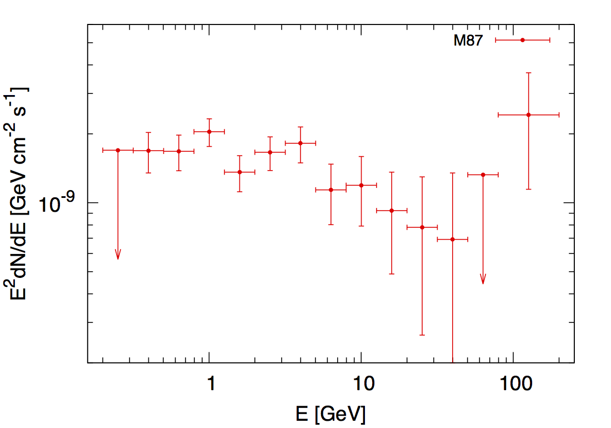

# Spectral Energy Distribution (SED)

## 目录结构

M87

>data_binned  
>>M87.fits

>binned  
>>[var_comman.gts](binned/var_common.gts)  
>>M87_gti.fits  
>>M87_ltcube.fits

>sed  
>>[sed.gts](sed/sed.gts)  
>>[ul.py](sed/ul.py)  
>>[eranges.gts](sed/eranges.gts)  
>>[eranges.dat](sed/eranges.dat)  
>>[plt_gen.py](sed/plt_gen.py)  
>>[sed.plt.in](sed/sed.plt.in)  
>>[model_input_sed.xml](sed/model_input_sed.xml)

## 产生分bin文件

运行[eranges.gts](sed/eranges.gts)，输入分bin的个数（本例中为10），即可得到分bin的文件：  
[eranges.dat](sed/eranges.dat):
```bash
200
399
796
1589
3170
6325
12619
25178
50237
100236
199998
```
注意，可以用#来注释行，便于能量bin的合并（统计量严重不足时）。

## 模型文件的选择

如果没有特殊情况或特别要求的话，建议选用全能段gtlike(binned)得到的输出model文件来作为SED计算时gtlike的输入model，
不过最好把目标源(M87)的Prefactor的拟合范围的上边界放宽一些，以保证在计算上限时不会走到边界。

## 跑SED

废话不多说，直接上code，自认为可读性良好，相信大家都能看懂。。。  
[sed.gts](sed/sed.gts):
```bash
#!/bin/bash

ln -sf ../binned/var_common.gts var_common.gts
. var_common.gts

ln -sf ../binned/$file_filtered_gti $file_filtered_gti
ln -sf ../binned/$file_ltcube $file_ltcube

dir_results=results
rm -rf $dir_results && mkdir $dir_results
file_model_initial=model_input_sed.xml

par_enumbins=5

echo '#Emin Emax Flux FluxErr TS' > flux_tmp

cat eranges.dat | sed '/^#/d' | sed '1!H;x;1d' | sed 'N;s/\n/ /' |
while read par_emin par_emax
do
  #[[ "x$flag" = "x0" ]] && break
  flag=1

  par_emin_g=`awk "BEGIN{print $par_emin/1000}"`
  par_emax_g=`awk "BEGIN{print $par_emax/1000}"`
  file_model_1st=$dir_results/model_1st_${par_emin}_$par_emax.xml
  file_model_final=$dir_results/model_final_${par_emin}_$par_emax.xml
  file_model_ul=$dir_results/model_ul_${par_emin}_$par_emax.xml
  file_result_1st=$dir_results/result_1st_${par_emin}_$par_emax.dat
  file_result_final=$dir_results/result_final_${par_emin}_$par_emax.dat

  gtbin evfile=$file_filtered_gti scfile=$file_spacecraft outfile=$file_ccube algorithm=CCUBE ebinalg=LOG emin=$par_emin emax=$par_emax enumbins=$par_enumbins nxpix=$par_nxpix nypix=$par_nypix binsz=$par_binsz coordsys=CEL xref=$par_ra yref=$par_dec axisrot=0 proj=AIT &&
  gtexpcube2 infile=$file_ltcube cmap=none outfile=$file_expcube irfs=$par_irfs nxpix=400 nypix=400 binsz=0.2 coordsys=CEL xref=$par_ra yref=$par_dec axisrot=0 proj=AIT ebinalg=LOG emin=$par_emin emax=$par_emax enumbins=$par_enumbins ebinfile=none &&
  gtsrcmaps scfile=$file_spacecraft expcube=$file_ltcube cmap=$file_ccube srcmdl=$file_model_initial bexpmap=$file_expcube outfile=$file_srcmap irfs=$par_irfs ptsrc=yes &&
  gtlike irfs=$par_irfs expcube=$file_ltcube srcmdl=$file_model_initial statistic=BINNED optimizer=DRMNFB evfile=$file_filtered_gti scfile=$file_spacecraft cmap=$file_srcmap bexpmap=$file_expcube sfile=$file_model_1st results=$file_result_1st &&
  gtlike irfs=$par_irfs expcube=$file_ltcube srcmdl=$file_model_1st statistic=BINNED optimizer=NEWMINUIT evfile=$file_filtered_gti scfile=$file_spacecraft cmap=$file_srcmap bexpmap=$file_expcube sfile=$file_model_final results=$file_result_final &&

  flag=1 || flag=0

  [[ "x$flag" = "x0" ]] && continue

  flux=`egrep "$par_srcname|Flux" $file_result_final | grep $par_srcname -A 1 | grep Flux | cut -d "'" -f 4 | sed 's/\+\/-//'`
  TS=`egrep "$par_srcname|TS" $file_result_final | grep $par_srcname -A 1 | grep TS | cut -d "'" -f 4`

  if [ `awk -v ts=$TS "BEGIN{if(ts > 4) print 1; else print 0}"` = 1 ]
  then
    echo "$par_emin_g $par_emax_g $flux $TS" >> flux_tmp
  else
    echo "#$par_emin_g $par_emax_g $flux $TS" >> flux_tmp &&
    # fix all parameters of the target source in the model file used by the Upper Limit calculation.
    awk 'BEGIN{tag=0} /^.*'$par_srcname'/{tag=1}{if(tag==1) sub(/free=\"1\"/, "free=\"0\""); print}/^.*<\/source>$/{tag=0}' $file_model_final > $file_model_ul &&
    python ul.py ul.dat $par_srcname $par_irfs $par_emin $par_emax $file_srcmap $file_ltcube $file_expcube $file_model_ul &&
    ul=`cat ul.dat | sed 's/^\[\([^ ]*\).*$/\1/'` &&
    echo "$par_emin_g $par_emax_g $ul 0 -1e9" >> flux_tmp &&
    rm -rf ul.dat &&
    flag=1 || flag=0
  fi
done

column -t flux_tmp > flux.dat
rm -rf flux_tmp

python plt_gen.py $par_srcname
gnuplot sed.plt
```
其中调用了两个python脚本：  
1. [ul.py](sed/ul.py)，这是用来计算上限的，TS小于设定值时会触发调用。  
2. [plt_gen.py](sed/plt_gen.py)，这个脚本是根据SED计算得到的[flux.dat](sed/flux.dat)，
完善Gnuplot绘图脚本草稿[sed.plt.in](sed/sed.plt.in)得到最终绘图脚本[sed.plt](sed/sed.plt).

另外需要注意的是，计算upper limit时所用的model文件中，目标源(M87)最多只能放开第一个Prefactor参数，
其实Prefactor放不放开没任何区别，我的脚本中就把目标源的参数全固定了。

*代码中的一些细节处理建议大家仔细看一下。*

得到的结果data如下：  
[flux.dat](sed/flux.dat)
```
#Emin     Emax     Flux         FluxErr      TS
0.2       0.399    2.84355e-09  9.96282e-10  10.2222
0.399     0.796    2.3152e-09   3.31735e-10  67.8719
0.796     1.589    1.2442e-09   1.4409e-10   138.708
1.589     3.17     4.68551e-10  6.86176e-11  124.027
3.17      6.325    2.62708e-10  3.77079e-11  134.59
6.325     12.619   8.78697e-11  1.95212e-11  65.8601
12.619    25.178   4.07914e-11  1.5708e-11   38.1253
25.178    50.237   6.30638e-12  1.28091e-12  5.62373
50.237    100.236  1.26951e-11  9.90711e-12  11.6395
#100.236  199.998  5.588e-12    8.71269e-13  3.37174
100.236   199.998  2.31e-11     0            -1e9
```

## 最终结果

给大家展示一下结果，这是从200MeV到200GeV分了10个bin的：


## 另一种分bin方式的结果

这是分了15个bin的结果，实际上是14个bin，因为最后两个bin合并了。
```
200
317
502
796
1262
2000
3170
5024
7962
12619
20000
31698
50238
79621
#126191
200000
```
```
#Emin    Emax    Flux         FluxErr      TS
#0.2     0.317   1.54393e-09  9.85124e-10  3.68576
0.2      0.317   3.13e-09     0            -1e9
0.317    0.502   1.96195e-09  3.93792e-10  28.5134
0.502    0.796   1.23351e-09  2.19244e-10  44.4218
0.796    1.262   9.47445e-10  1.30946e-10  93.0374
1.262    2       3.97849e-10  7.14699e-11  63.3815
2        3.17    3.06439e-10  5.12362e-11  95.5813
3.17     5.024   2.11603e-10  3.78606e-11  115.435
5.024    7.962   8.35941e-11  2.46896e-11  45.0946
7.962    12.619  5.52092e-11  1.85532e-11  42.4172
12.619   20      2.70281e-11  1.27359e-11  24.7978
20       31.698  1.4405e-11   9.53163e-12  12.6308
31.698   50.238  8.05254e-12  7.64687e-12  6.26249
#50.238  79.621  2.28664e-19  1.61931e-15  -6.01749e-08
50.238   79.621  9.73e-12     0            -1e9
79.621   200     1.82881e-11  9.63632e-12  16.7822
```

