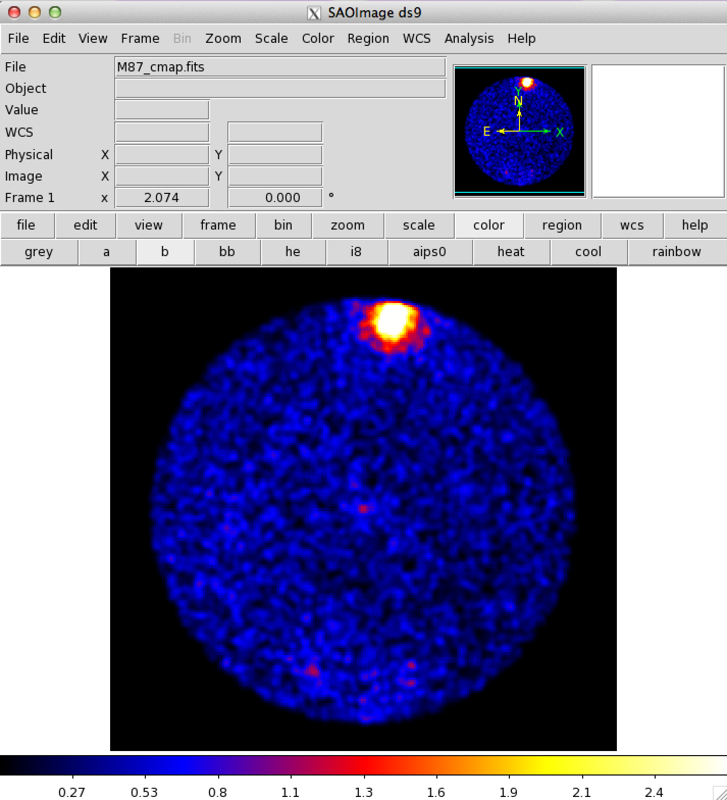

# Unbinned Likelihood Method

Fermi-LAT[官方教程](http://fermi.gsfc.nasa.gov/ssc/data/analysis/scitools/likelihood_tutorial.html)

## 目录结构

M87

>data_unbinned  
>>events  
>>M87.fits

>binned  
>>where to put all the [scripts](unbinned/)


## 数据选取

* SOURCE data (evclass=2)

* 能量范围：200MeV - 200GeV

* 时间范围：最近一年 (MET 407902364 - MET 423454364)

* ROI中心：(RA, DEC) = (187.706, 12.3911) degrees

* ROI半径：10 degrees


## 变量定义

最好考虑多脚本之间的重用特性。

[var_common.gts](unbinned/var_common.gts):
```bash
#!/bin/bash

par_srcname=M87
par_irfs=P7REP_SOURCE_V15

file_filtered=../data_unbinned/"$par_srcname".fits
file_filtered_gti="$par_srcname"_gti.fits
file_spacecraft=~/data_Fermi/spacecraft.fits
file_cmap="$par_srcname"_cmap.fits
#file_ccube="$par_srcname"_ccube.fits
file_ltcube="$par_srcname"_ltcube.fits
file_expmap="$par_srcname"_expmap.fits
#file_expcube="$par_srcname"_expcube.fits
#file_srcmap="$par_srcname"_srcmap.fits
file_model_initial=model_input_binned.xml
file_model_1st=model_1st_binned.xml
file_model_final=model_output_binned.xml
file_model_tsmap_resi=model_tsmap_resi.xml
file_tsmap_resi="$par_srcname"_tsmap_resi.fits

position=`gtvcut $file_filtered EVENTS | sed -n '/CIRCLE/ s/.*(\(.*\))/\1/p'`
par_ra=`echo $position | cut -d , -f 1` 
par_dec=`echo $position | cut -d , -f 2`
par_emin=200
par_emax=200000
```

## 与飞船有关的计算

gtmktime, gtltcube, gtexpmap.

[sc_filter.gts](unbinned/sc_filter.gts):
```bash
#!/bin/bash

. var_common.gts &&

gtmktime scfile=$file_spacecraft filter="(DATA_QUAL==1)&&(LAT_CONFIG==1)&&ABS(ROCK_ANGLE)<52" roicut=yes evfile=$file_filtered outfile=$file_filtered_gti &&

gtltcube evfile=$file_filtered_gti scfile=$file_spacecraft outfile=$file_ltcube dcostheta=0.025 binsz=1 &&

#python gtltcube_mp.py 5 $file_spacecraft $file_filtered_gti $file_ltcube --zmax 100 &&

gtexpmap evfile=$file_filtered_gti scfile=$file_spacecraft expcube=$file_ltcube outfile=$file_expmap irfs=$par_irfs srcrad=20 nlong=200 nlat=200 nenergies=30 &&

#python gtexpmap_mp.py 200 200 5 5 $file_spacecraft $file_filtered_gti $file_ltcube $par_irfs 20 30 $file_expmap &&

echo
```

## 一个简单直观的view

gtbin.

[cmap.gts](unbinned/cmap.gts):
```bash
#!/bin/bash

. var_common.gts &&

gtbin evfile=$file_filtered_gti scfile=$file_spacecraft outfile=$file_cmap algorithm=CMAP nxpix=200 nypix=200 binsz=0.1 coordsys=CEL xref=$par_ra yref=$par_dec axisrot=0 proj=AIT &&

echo
```

counts map:



## 生成模型xml文件

使用[make2FGLxml](http://fermi.gsfc.nasa.gov/ssc/data/analysis/user/)包来生成与当前数据相关的2FGL源的model文件。

[model.py](unbinned/model.py):
```python
# For P7REP_SOURCE_V15 data, ST version v9r33p0
from make2FGLxml import *
import os
import commands as cmd

srcfile = cmd.getoutput(". ./var_common.gts && echo $file_filtered_gti")
catalog_dir = os.environ.get('HOME') + '/data_Fermi/catalog'

mymodel = srcList(catalog_dir + '/gll_psc_v08.fit',
                  srcfile, 'model.xml')
pathtodiffusefiles = os.environ.get('FERMI_DIR') + '/refdata/fermi/galdiffuse'
mymodel.makeModel(pathtodiffusefiles + '/gll_iem_v05_rev1.fit',
                  'gll_iem_v05_rev1',
                  pathtodiffusefiles + '/iso_source_v05_rev1.txt',
                  'iso_source_v05',
                  extDir=catalog_dir + '/Templates')
```

生成该文件后，还要手动进行修改，目的是：  
1. **增加目标源**（如不在2FGL中），或修改目标源名称以便识别（如在2FGL中），后者不是必须；  
2. **固定一部分参数**以降低不必要的计算量。

## Binned likelihood

gtdiffrsp, gtlike.

[like_binned.gts](binned/like_binned.gts):
```bash
#!/bin/bash

. var_common.gts &&

#gtdiffrsp evfile=$file_filtered_gti scfile=$file_spacecraft srcmdl=$file_model_intitial irfs=$par_irfs &&

gtlike irfs=$par_irfs expcube=$file_ltcube srcmdl=$file_model_initial statistic=UNBINNED optimizer=DRMNFB evfile=$file_filtered_gti scfile=$file_spacecraft expmap=$file_expmap sfile=$file_model_1st results=result_1st.dat specfile=counts_spectra_1st.fits plot=yes &&

gtlike irfs=$par_irfs expcube=$file_ltcube srcmdl=$file_model_1st statistic=UNBINNED optimizer=NEWMINUIT evfile=$file_filtered_gti scfile=$file_spacecraft expmap=$file_expmap sfile=$file_model_final results=result_final.dat specfile=counts_spectra_final.fits plot=yes &&

echo
```

两次gtlike的plot:


## 计算TS map

gttsmap.

[TS map](unbinned/tsmap.gts):
```bash
#!/bin/bash

. var_common.gts &&

gttsmap evfile=$file_filtered_gti scfile=$file_spacecraft expmap=$file_expmap expcube=$file_ltcube srcmdl=$file_model_tsmap_resi outfile=$file_tsmap_resi irfs=$par_irfs optimizer=NEWMINUIT ftol=1e-2 nxpix=70 nypix=70 binsz=0.2 coordsys=CEL xref=$par_ra yref=$par_dec proj=AIT statistic=UNBINNED &&

echo
```
